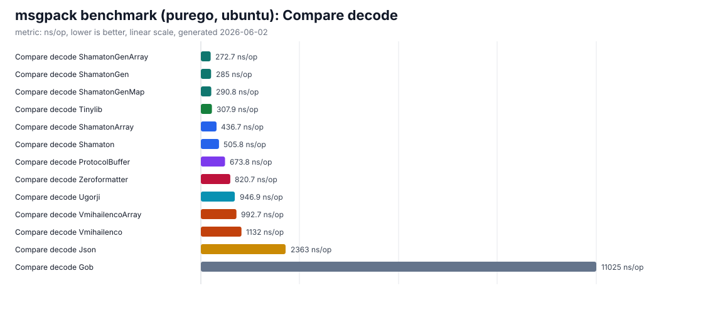
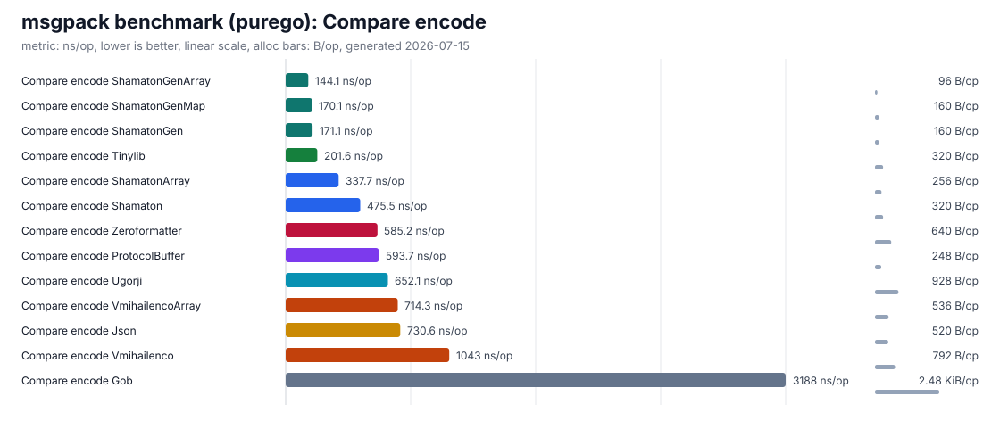
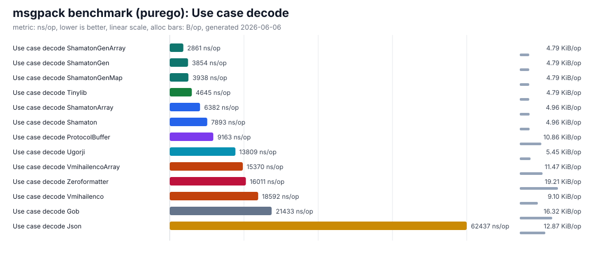
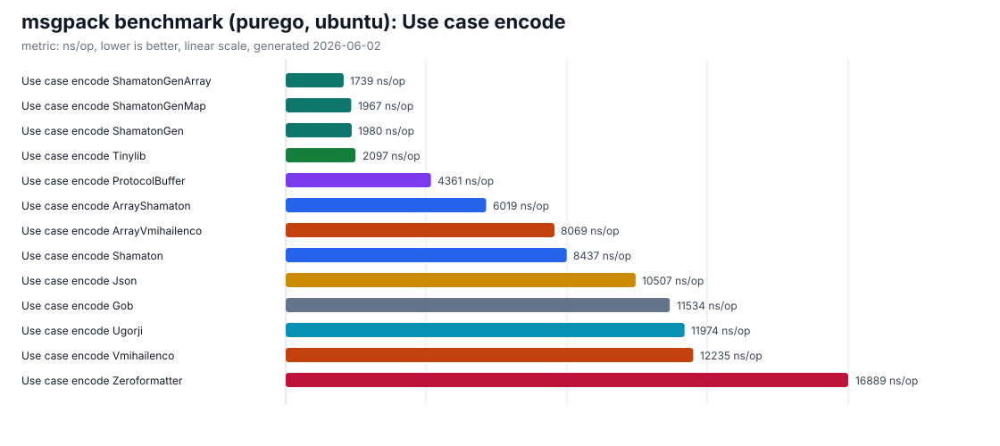
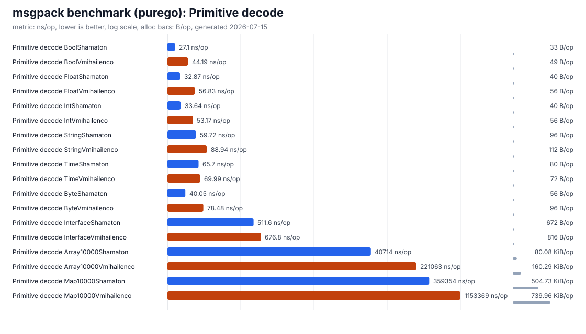
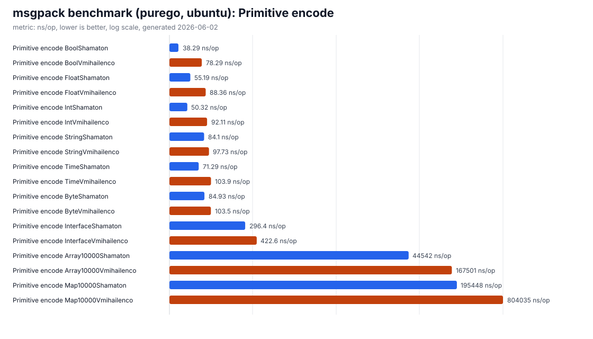
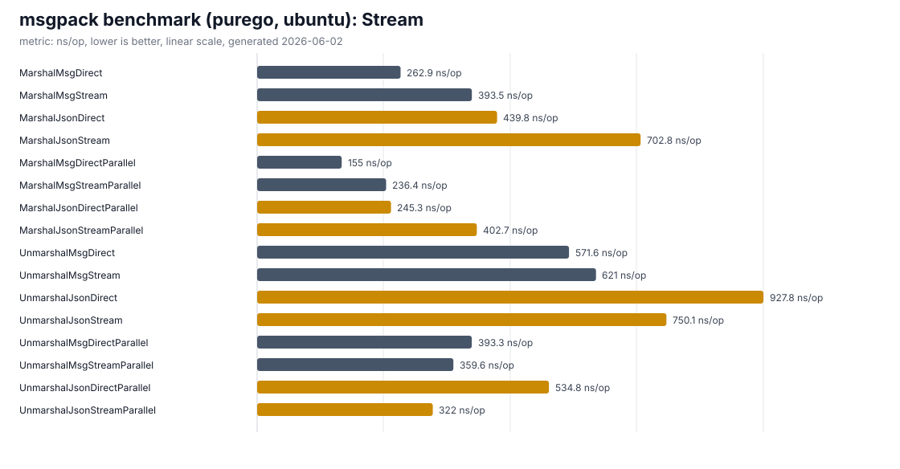

# msgpack_bench

Benchmarks for MessagePack libraries and related serialization formats.

## Update benchmark results

Run the benchmark suite with the `purego` build tag and regenerate SVG charts:

```sh
scripts/update-bench-svg.sh
```

The script writes the raw benchmark output to `docs/benchmarks/latest.txt` and generates SVG charts in `docs/benchmarks/`.

Generated chart files:

- `compare-decode.svg`
- `compare-encode.svg`
- `usecase-decode.svg`
- `usecase-encode.svg`
- `primitive-decode.svg`
- `primitive-encode.svg`
- `stream.svg`

## Benchmark method

The checked-in benchmark results are generated with Go's benchmark runner:

```sh
go test -tags purego -run '^$' -bench . -benchmem ./...
```

`scripts/update-bench-svg.sh` runs that command, stores the raw output in `docs/benchmarks/latest.txt`, and regenerates the SVG charts in `docs/benchmarks/`.

The benchmark suite measures these groups:

- **Compare benchmarks** serialize and deserialize `BenchMarkStruct`, a compact struct with scalars, a slice, a map, and a nested child struct. These compare shamaton msgpack, generated msgpackgen code, tinylib/msgp, ugorji/codec, vmihailenco/msgpack, Protocol Buffers, JSON, gob, and zeroformatter.
- **Use case benchmarks** serialize and deserialize a `User` value with five equipment IDs and 100 `Item` values. This is the larger application-like payload in the suite.
- **Primitive benchmarks** compare `github.com/shamaton/msgpack/v3` and `github.com/vmihailenco/msgpack/v5` on scalar values, byte slices, heterogeneous interface values, a 10,000 element array, and a 10,000 entry map.
- **Stream benchmarks** compare direct `[]byte` APIs with reader/writer APIs. Decode direct benchmarks include the `io.ReadAll` step because they model a request-body path where data first arrives as an `io.Reader`. Parallel variants use `b.RunParallel`.

Encode output is decoded once during initialization and decode output is checked against the source value before benchmark timing starts. Decode benchmarks reuse pre-encoded payload bytes and allocate the destination value inside the timed loop. Lower `ns/op` is better.

## Benchmark charts

The latest checked-in result file was recorded as `goos: linux`, `goarch: arm64`, with Go benchmark suffix `-14` and the `purego` build tag.
Full raw results are in [`docs/benchmarks/latest.txt`](docs/benchmarks/latest.txt).
The charts below are generated from the same raw output and plot `ns/op`. Lower bars are faster.

### Compare decode



Decodes the compact `BenchMarkStruct` payload. The struct contains integer, float, bool, string, slice, map, and nested child fields. The benchmark compares map and array encoded MessagePack payloads with shamaton/msgpack, shamaton/msgpackgen, tinylib/msgp, ugorji/codec, vmihailenco/msgpack, and non-MessagePack formats such as Protocol Buffers, JSON, gob, and zeroformatter.

### Compare encode



Encodes the same compact `BenchMarkStruct` value used by the compare decode benchmark. This chart focuses on serialization cost for each library and format, including generated-code encoders, reflection-based MessagePack encoders, and the non-MessagePack formats.

### Use case decode



Decodes the larger `User` payload. The value includes scalar user fields, five equipment IDs, and 100 `Item` records. This benchmark is intended to represent a more application-like nested payload than the compact compare struct.

### Use case encode



Encodes the same larger `User` payload used by the use case decode benchmark. The chart compares generated MessagePack, reflection-based MessagePack, and other serialization formats on a nested value with repeated child records.

### Primitive decode



Decodes individual primitive and collection payloads with shamaton/msgpack and vmihailenco/msgpack. The measured values include int, float, string, bool, `time.Time`, byte slices, heterogeneous interface values, a 10,000 element integer array, and a 10,000 entry string-to-int map.

### Primitive encode



Encodes the same primitive and collection values used by the primitive decode benchmark with shamaton/msgpack and vmihailenco/msgpack. This isolates simple value and large collection serialization costs outside the struct benchmarks.

### Stream



Compares direct `[]byte` APIs with stream-oriented reader/writer APIs for MessagePack and JSON. Decode direct benchmarks include reading the input from an `io.Reader` with `io.ReadAll` before calling the direct unmarshal API, while stream decode benchmarks consume the reader directly. Encode stream benchmarks write to a `bytes.Buffer`; direct encode benchmarks return a byte slice.
